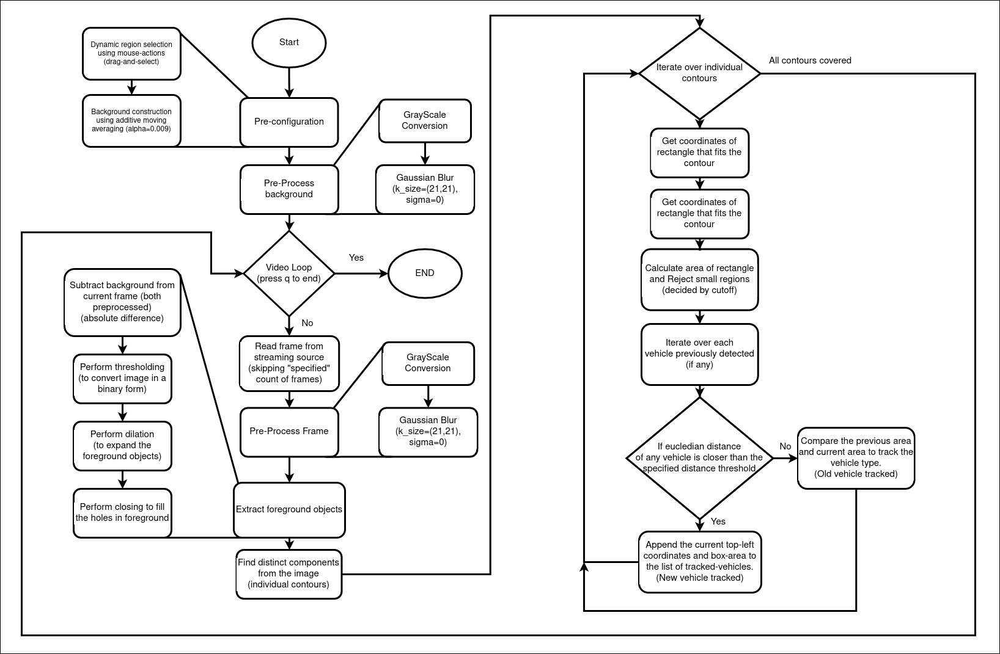
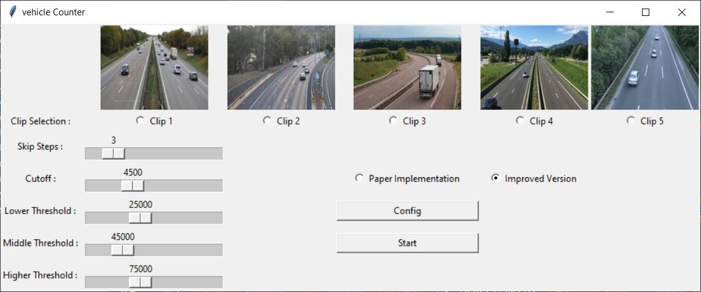
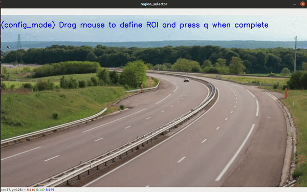

# Team: Primage Imocessors
    

**Project for Digital Image Processing (*CS7.404.M21*) - Monsoon 2021**

## Project Representatives:
1. Aditya Kumar Singh - 2021701010
2. Bhoomendra Singh Sisodiya - 2021701037
3. Dhruv Srivastava - 2021701021
4. Prateek Jaiswal - 2021701009

## Quick links
1. [Overview](#overview)
2. [Directory Structure](#directory-structure)
3. [Instructions](#instructions-to-run-the-project-and-replicate-the-results)
4. [Results](#our-results)
5. [Dependencies](#dependencies)

## Overview

The aim is to design a **vehicle detection and counter** using a combination of different video-image processing methods including object detection, edge detection, frame differentiation, and Kalman filtering. \
The presented code includes implementation with two different approaches-
- Using previous frames for motion detection as proposed in [link](https://ieeexplore.ieee.org/document/7161621)
- Constructing a background using moving-averaging and using it to detect motion from current frames.

Using automated methods, one can execute better traffic management methods, such as changing the timings of traffic lights based on traffic flow, traffic surveillance, etc. We’ll mainly focus on vehicle detection on roadways and classify the passing vehicles in different specific types. The video data used for this project can be downloaded from [here](https://drive.google.com/drive/folders/15gR9uQ_g_oVaI7E9a7ZXU-wh7msEZT-x?usp=sharing).

## Flow chart of proposed improved method



 Paper Method | Improved Method 
:--------------:|:-----------------
  |  

## Directory Structure
```
├── data
    ├── 1.mp4
    ├── 2.mp4
    ├── 3.mp4
    ├── 4.mp4
    └── 5.mp4
├── images
    ├── 1.gif
    ├── 2.gif
    ├── 3.gif
    ├── 4.gif
    ├── 5.gif
    ├── bg_creation.gif
    ├── flow_chart.gif
    ├── kalman_filter.gif
    ├── prev_prev_frame_issue.png
    ├── region_selection.gif
    ├── single_lane_detection.gif
    └── sobel_edge_det_issue.png
├── KalmanFilter.py
├── gui.py
├── project_ppt.pptx
├── requirements.txt
├── runner.py
├── vehicle_detection.py
└── README.md
```

## Instructions to run the project and replicate the results
### 1. Create a virtual environment
```
$ virtualenv -p python3 venv
```
If ```virtualenv``` is not installed on your system, it is recommended to use pip for the same. <br>
(```$ pip install virtualenv```)
 
### 2. Activate the virtualenv and install the project ```requirements```
For Ubuntu/MacOS-
```
$ source venv/bin/activate
$ pip install -r requirements.txt
```
For Windows OS-
```
venv\Scripts\activate
pip install -r requirements.txt
```

### 3. Execute the `GUI` script
```
$ python gui.py
```


### 4. Instructions to operate the `GUI.py`.
1. In `Clip Selection Menu` choose one clip on which you want to perform vehicle tracking. (*Clip x* is a short video from a traffic camera, where each video is different from other.)
2. `Create Dynamic Background` option: Allows one to manually select the **ROI** (Region of Interest) or detection zone by *dragging the mouse followed by pressing `q` for confirming the region selected*.<br><br>
3. `Paper Replicate` option:
    1. If `True` then one will be reproducing the results from paper.
        1. Video frames Preprocessing:
            1. `Gray Scale` conversion of original **RGB** frames.
            2. `Gamma Transformation` of gray frames with gamma factor = 1.2.
            3. Applying `Sobel` filter to detect edges followed by *thresholding* to convert it into binary images.
        2. Motion Analysis:
            1. To detect vehicle, background subtraction is done by **frame differentiation** method where commonality of Nth and (N-1)th binary frames is subtracted from the commonality of (N+1)th and Nth binary frames.<br><br> 
            4. Next, a detection zone is defined manually as mentioned above (on which all operations are carried out).
            5. For each moving vehicle a `KalmanFilter` object is assigned (which also acts as it's `ID`) to track and estimate it's position (or co-ordinate) as well as minimize noise disorders. Although edge detection can find moving objects, the Kalman filter makes an optimal estimate of positions based on a sequence of localization measurement.
            6. Now the total counts of such `ID` (which is a `list` consisting of vehicle's position info, `KalmanFilter` object, and its bounding box area) will not only give us the total count of vehicles passed but also which type of vehicles have passed using bounding box's area information.
    2. Else, we'll be using our own `Modified Method`.
        1. Constructed a '*static*' backgorund using `Moving Average` method.<br><br>
        2. Video frames Preprocessing: Applied `GrayScale` conversion followed by `GaussianFiltering` to smoothen out the artefacts and unnecessary noises.
        3. Execute **background subtraction** by taking absolute difference (`cv2.absdiff()`) between current video frame and static background.
        4. `Thresholding` followed by `Dilation` ensures that the (disconnected components of) moving vehicle in obtained binary image comes out as a single "white blob" (or component).
        5. Using `nearest neighbor` criteria, connect a given vehicle's position in each frame to track its bounding box so as to maintain the counter.
    3. A total of **four classes** are there on the basis of size of vehicle, namely,:
        * *Type1*: bicycles, motorcycles.
        * *Type2*: motorcars.
        * *Type3*: pickups, minibuses.
        * *Type4*: buses, trucks, trailers.
    4. Using bounding boxes area, we try to predict the class of vehicle and update their class counter.

## Our Results

### For modified (our) method.

#### DETECTION TEST RESULTS

| Actual vehicle passed | Counted number of vehicles by the method | Number of errors |
|-----------------------|------------------------------------------|------------------|
| 44                    | 42                                       | 4.54%            |

#### Confusion Matrix

| CF Matrix | Type 1 | Type 2 | Type 3 | Type 4 |
|-----------|--------|--------|--------|--------|
| Type 1    | 0      | 0      | 0      | 0      |
| Type 2    | 1      | 28     | 0      | 0      |
| Type 3    | 0      | 0      | 10     | 0      |
| Type 4    | 0      | 0      | 0      | 3      |
| Noises    | 0      | 0      | 0      | 0      |

### For method mentioned in paper.

#### DETECTION TEST RESULTS

| Actual vehicle passed | Counted number of vehicles by the method | Number of errors |
|-----------------------|------------------------------------------|------------------|
| 44                    | 58                                       | 18.18%           |

#### Confusion Matrix

| CF Matrix | Type 1 | Type 2 | Type 3 | Type 4 |
|-----------|--------|--------|--------|--------|
| Type 1    | 1      | 0      | 0      | 0      |
| Type 2    | 2      | 25     | 0      | 0      |
| Type 3    | 0      | 1      | 10     | 0      |
| Type 4    | 0      | 0      | 2      | 3      |
| Noises    | 8      | 0      | 0      | 0      |                   


## Dependencies
```
cycler==0.11.0
kiwisolver==1.3.2
matplotlib==3.4.3
numpy==1.21.4
opencv-python==4.5.4.58
Pillow==8.4.0
pyparsing==3.0.6
python-dateutil==2.8.2
six==1.16.0
tk==0.1.0
```
